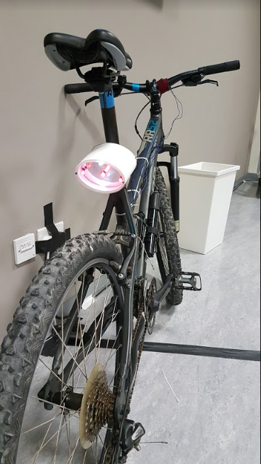
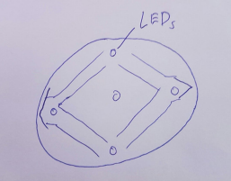
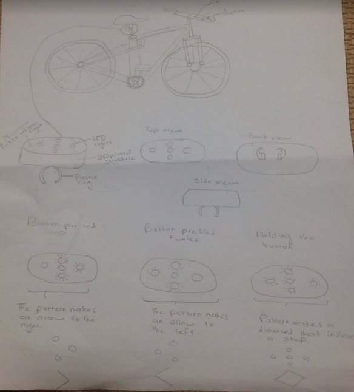
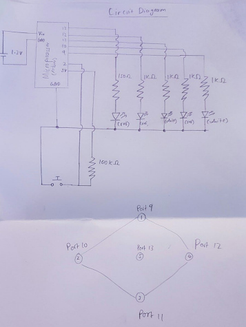
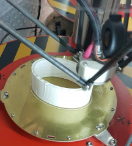
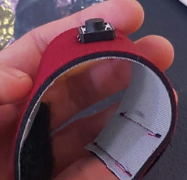

# BikeTurner - Turn signals meet bikes.

A novel Arduino Nano product prototype using a 3d printer and laser cutter.

---

* Are you tired of constantly sticking your arm to the side when you bike?
* Do you wish you had the convenience of turn signals on your bike?
* Is your bike light not intelligent enough for you?

Here comes **BikeTurner**. A smart bike light that functions as a turn signal. With a single press of a button you can indicate to traffic where you are headed.

<p align="center">
  
</p>

### Operations overview:

* Assembly:
  1. Attach the bike light with the velcro straps to the front beam of the bike
  2. With the button attach using velcro straps onto the handle of the bike.
  3. Using the plastic straps, secure the wire onto the frame of the bike
* Operation:
  1. Turn on the switch
  2. Press the button once to display the ‘right’ arrow
  3. Double click the button to display the ‘left’ arrow
  4. Hold down the button for around 1 second to display the ‘slowing down’ sign
  5. Hold down the button for longer to turn it off.


<p align="center">
  
  
</p>

### Circuitry

The final micro-controller used in this project is the Arduino Nano, but prototyped using the Arduino Mega. To emulate the project, `git clone` and then using a serial link, upload `BikeTurner.ino` to your arduino.

The circuitry can be wired according to the following diagram:

<p align="center">
  
</p>

Parameters for the pins used on the arduino can be adjusted by changing these values within `BikeTurner.ino`

```
int VarButton = 2;        // Input pin of pulldown button
int LED1 = 9;          // digital output pin for LED 1
int LED2 = 10;          // digital output pin for LED 2
int LED3 = 11;          // digital output pin for LED 3
int LED4 = 12;          // digital output pin for LED 4
int LED5 = 13;          // digital output pin for LED 5
```

Similarily, the time to detect a `click, double click, hold and long hold` can be adjusted by changing these parameters:

```
int DoubleClickGap = 300;   // Time the user has to double click
int HoldGap = 500;        //Time the user holds the button before it
```

### Manufacture

The prototype 3d model is designed from our sketches in Autocad. You can create your own or or simply upload the stl files to a 3d printer and adjust extrude settings until the print quality is satisfactory **Note:** Extrude settings vary between printers so you should adjust until the print is even.

To create the control grip, use a felt material and a standard push button. Attach the push button between two felt materials using a sewing machine.

<p align="center">
  
  
</p>

To create the back mirror of the light, use an aluminium sheet cut to size using a laser cutter. Our designs were created using Adobe Illustrator and adjusted iteratively first on cardboard, and then on the material.

### Assembly.

* After wiring your Arduino nano, group the wires and shrink heat a wire cover on the bundle so you can easily attach the bundle along the body of the bike.

* Use a portable 9v battery which should ideally last several days.

* Enclose the arduino within the 3d printed case, making sure that the on/off button can be accessed.

* The reflective covers can be secured on the bike light using 4 screws as indicated by holes on the laser cutting diagram.

* Attach the button to the front handle of the bike.

* You are good to go!
